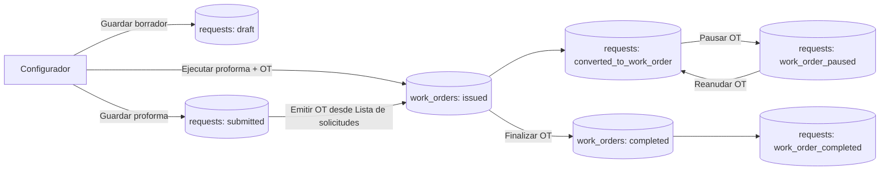

# 01. Visión general del flujo

## Secciones del módulo

1. **Configurador de proformas y OT** (`/dashboard/configurator`)
2. **Lista de solicitudes** (`/dashboard/requests-list`)
3. **Lista de órdenes de trabajo** (`/dashboard/work-orders`)

## Flujo end-to-end

## Ideas clave

- El **origen funcional** del flujo es siempre una solicitud en `requests`.
- La OT se emite vía Cloud Function (`createWorkOrder`) y queda vinculada por `sourceRequestId`/`linkedWorkOrderId`.
- La lista de solicitudes es la consola de operación para:
  - visualizar,
  - editar casos permitidos,
  - emitir OT,
  - pausar/reanudar OT,
  - eliminar solicitud.
- La lista de órdenes de trabajo centraliza el seguimiento de OT emitidas y permite **finalizar**.

## Dependencias backend (Cloud Functions)

- `createWorkOrder`
- `pauseWorkOrder`
- `resumeWorkOrder`
- `completeWorkOrder`
- `deleteProforma`

Estas funciones son llamadas desde frontend y son responsables de la lógica transaccional de estado entre solicitud y OT.
