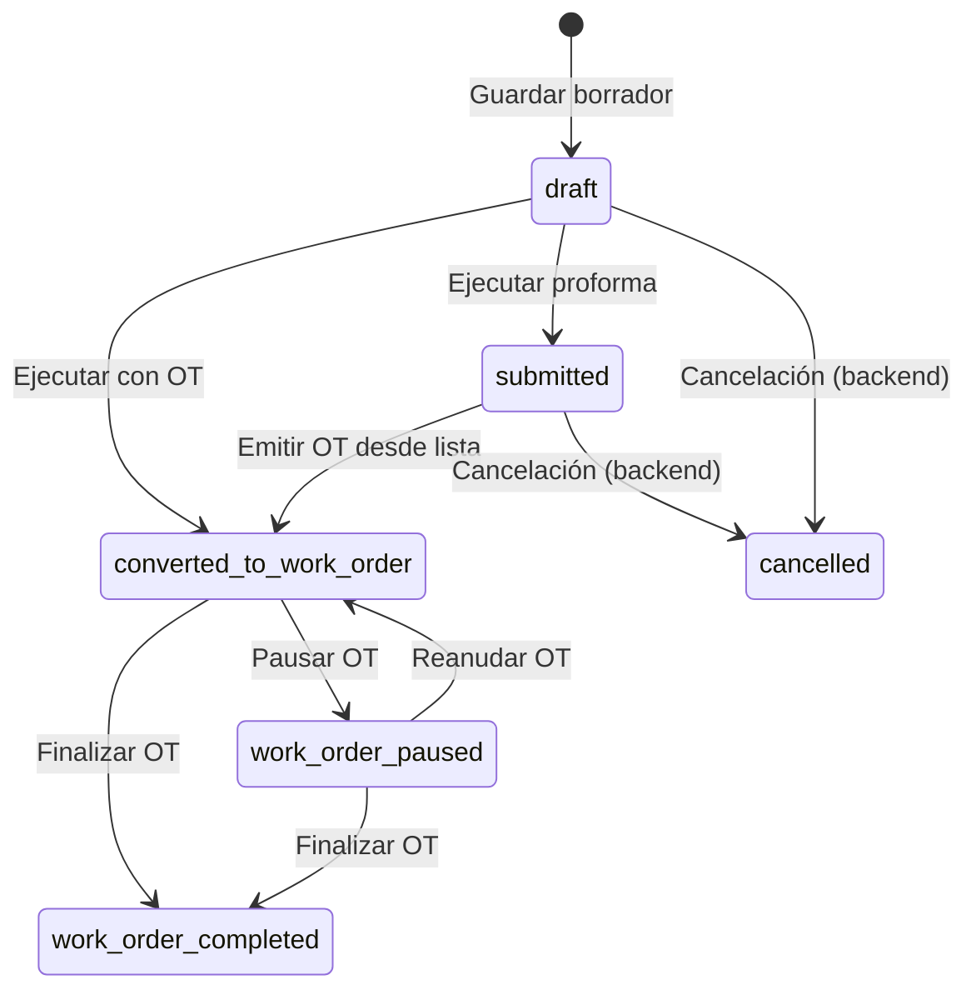
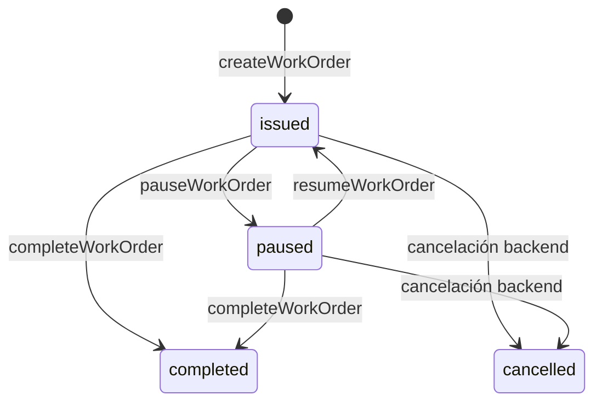

# 05. Estados y transiciones

## 1) Solicitud de servicio (`service_requests`)

Estados declarados:

- `draft`
- `submitted`
- `converted_to_work_order`
- `work_order_paused`
- `work_order_completed`
- `cancelled`

### Transiciones operativas

## 2) Orden de trabajo (`work_orders`)

Estados usados en listado:

- `issued`
- `paused`
- `completed`
- `cancelled`
- `unknown`

### Transiciones operativas

## 3) Mapeos internos importantes

En `src/features/configurator/services/configurations.ts`:

- `ConfigurationStatus` (`draft|final`) se traduce a `ServiceRequestStatus`:
  - `final -> submitted`
  - `draft -> draft`
- Al leer solicitud para el configurador (`getConfigurationById`):
  - `submitted/converted_to_work_order/work_order_paused/work_order_completed -> final`
  - resto -> `draft`
- `type` de configurador se persiste como `isWorkOrder` (booleano).

## 4) Cloud Functions que gobiernan transiciones

- `createWorkOrder` (emitir OT)
- `pauseWorkOrder` (pausar OT)
- `resumeWorkOrder` (reanudar OT)
- `completeWorkOrder` (finalizar OT)
- `deleteServiceRequest` (eliminar solicitud)

> El frontend orquesta UX y llamadas; la consistencia de negocio entre colecciones depende del backend.