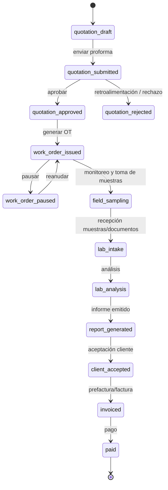

# 06. Plan de adaptación al flujo LABCHAVEZ

Este documento describe cómo adaptaría el sistema actual al flujo de negocio definido en `resourses/FLUJOS LABCHAVEZ.pdf`.

## Estado de implementación (10-03-2026)

Se implementó la base de Fase 1 en código:

- Nuevos callables backend:
  - `approveServiceRequest`
  - `rejectServiceRequest`
- Endurecimiento de emisión OT:
  - `createWorkOrder` ahora exige `approval.status === approved`.
  - Se eliminó el bypass de cliente con `forceEmit`.
- Cliente (servicios):
  - Se agregaron wrappers `approveServiceRequest` y `rejectServiceRequest`.
  - `createWorkOrderFromRequest` traduce el error de aprobación pendiente a mensaje funcional en español.

Implementado en UI: la pantalla de solicitudes ya expone acciones de aprobación/rechazo de proforma con motivo de rechazo.

Implementado en UI (MVP): nueva pantalla post-OT para registrar análisis de laboratorio en `/dashboard/lab-analysis` (acceso desde lista de OT).

## 1) Hallazgos clave (gap actual)

## Flujo esperado (según PDF)

El flujo esperado incluye explícitamente:

1. Cotización / proforma
2. Licitación (si aplica)
3. Aprobación
4. Generación OT
5. Logística / asignación de técnicos
6. Monitoreo en campo
7. Registros de campo + muestras
8. Recepción de muestras y documentos en laboratorio
9. Análisis
10. Informes
11. Aceptación cliente
12. Prefactura / factura / pago

## Flujo actual en web

Hoy la web cubre bien:

- Configuración comercial/técnica de la solicitud.
- Emisión / pausa / reanudación / finalización de OT.

Pero no modela formalmente:

- Aprobación previa obligatoria de proforma.
- Registro operativo de campo (cadena/registro).
- Recepción de muestras/documentos de laboratorio.
- Resultado analítico formal y aceptación cliente.
- Circuito financiero (prefactura/factura/pago).

## Problema puntual de “muestras en configurador”

Actualmente las muestras aparecen en configurador porque el formulario mezcla etapa comercial con etapa operativa.

En el flujo LABCHAVEZ, las muestras reales ocurren después (campo/logística/lab), por lo que deberían capturarse en una etapa posterior, no en la fase de proforma.

## 2) Decisión sobre `type` (proforma/work_order/both)

## Verificación

- En frontend sí se usa `type` para decidir comportamiento del configurador.
- En backend `functions/` no se usa `type`; se usa principalmente `isWorkOrder` y estados.

## Recomendación

Retirar la dependencia de `type` como decisión central de negocio y mover el flujo a **máquina de estados**.

- Comercial define una solicitud (proforma/licitación).
- Aprobación habilita OT.
- Emisión OT depende de estado de aprobación, no de `type`.

## 3) Propuesta de flujo objetivo

## 4) Cambios funcionales propuestos

## 4.1 Configurador

Mover el configurador a “etapa comercial”:

- Mantener: cliente, matriz, alcance analítico, precios, notas comerciales.
- Quitar de esta etapa: detalle de muestras reales (códigos/observaciones de campo).
- Permitir solo:
  - guardar borrador comercial,
  - enviar proforma para aprobación.

## 4.2 Nueva etapa de aprobación

Agregar función explícita de aprobación (hoy no existe):

- `approveServiceRequest` (aprobación)
- `rejectServiceRequest` (retroalimentación/rechazo)

Campos sugeridos:

- `approval.status`: `pending | approved | rejected`
- `approval.approvedBy`, `approval.approvedAt`
- `approval.feedback`, `approval.rejectedAt`

Regla crítica:

- `createWorkOrder` solo permitido si `approval.status === approved`.

## 4.3 Campo y laboratorio

Agregar módulos/colecciones:

- `field_records` (registro/acta/cadena de custodia)
- `sample_intake` (recepción de muestras/documentos)
- `lab_results` (resultados analíticos)
- `reports` (informe técnico + ejecutivo)

Cada uno enlazado por `sourceRequestId` y, cuando exista, `workOrderId`.

## 4.4 Financiero

Agregar estado financiero posterior a aceptación:

- `client_accepted`
- `invoiced`
- `paid`

## 5) Cambios técnicos (alto nivel)

## Backend (`functions/`)

Agregar callables:

- `approveServiceRequest`
- `rejectServiceRequest`
- `registerFieldSampling`
- `registerLabIntake`
- `publishLabResults`
- `markClientAccepted`
- `markInvoiced`
- `markPaid`

Modificar callables actuales:

- `createWorkOrder`: exigir aprobación aprobada (sin bypass `forceEmit` en producción).
- `pauseWorkOrder`/`resumeWorkOrder`/`completeWorkOrder`: mantener.

## Frontend

- `Configurador`: separar comercial de operativo.
- `Lista de solicitudes`: incorporar columna/acción de aprobación y feedback.
- `Lista de OT`: mantener operaciones de estado OT.
- Nuevas vistas: campo, recepción lab, resultados, informes, financiero.

## 6) Plan de implementación por fases

## Fase 1 (rápida, alto impacto)

1. Crear aprobación formal (`approve/reject`).
2. Bloquear emisión OT sin aprobación.
3. Ajustar copy/UI para reflejar estado de aprobación.

## Fase 2 (operativa)

1. Sacar captura de muestras reales del configurador.
2. Crear módulo de registro de campo y cadena.
3. Crear módulo de recepción de muestras/documentos.

## Fase 3 (cierre técnico-comercial)

1. Módulo de resultados e informes.
2. Estado “aceptación cliente”.
3. Circuito financiero (prefactura/factura/pago).

## 7) Riesgos y controles

- Riesgo: ruptura de flujo actual por cambios de estado.
  - Control: feature flags + migración gradual.
- Riesgo: datos históricos sin campos nuevos.
  - Control: fallback de lectura y script de backfill.
- Riesgo: emisión OT por fuera de aprobación.
  - Control: validación obligatoria en Cloud Functions.

## 8) Respuesta directa a las dudas

- “¿Por qué muestras en configurador?”

  - Hoy está mezclada la etapa comercial y operativa; no está alineado al flujo LABCHAVEZ.

- “¿No deberían aprobar proforma antes de OT?”

  - Sí, según el flujo LABCHAVEZ debería existir esa compuerta.

- “¿Dónde está la función de aprobación?”
  - Actualmente no existe callable de aprobación dedicada; hay que implementarla.
