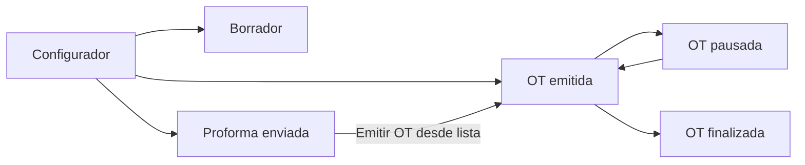

# 01. Flujo general de trabajo

## Resumen rápido

El proceso tiene 3 momentos:

1. **Configurar la solicitud**
2. **Gestionar la solicitud**
3. **Ejecutar y cerrar la orden de trabajo (OT)**

## Flujo visual

## Qué significa cada estado (en simple)

- **Borrador**: todavía en preparación; no se ejecuta nada.
- **Proforma enviada**: propuesta ya emitida, pero sin OT activa.
- **OT emitida**: trabajo ya iniciado operativamente.
- **OT pausada**: trabajo detenido temporalmente.
- **OT finalizada**: trabajo terminado y cerrado.
- **Cancelada**: solicitud anulada.

## Decisiones clave del negocio

- Si todavía faltan datos o revisión interna: **guardar como borrador**.
- Si solo se emite propuesta: **ejecutar proforma**.
- Si ya se inicia operación: **emitir OT**.
- Si hay bloqueo operativo temporal: **pausar OT**.
- Si el trabajo terminó: **finalizar OT**.